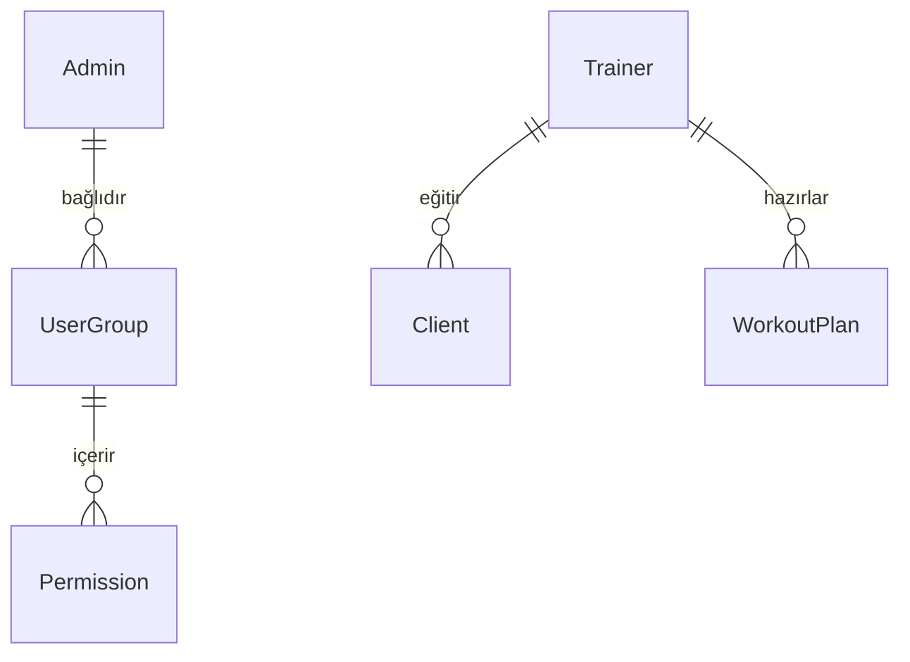

# FitHub Yönetim Sistemi - Teknik Dokümantasyon

Bu doküman, FitHub projesinin mevcut durumunu, teknik mimarisini, veritabanı yapısını ve sistem akışlarını detaylandırmaktadır.

## 1. Genel Bakış
FitHub, spor salonları ve kişisel antrenörler için tasarlanmış kapsamlı bir yönetim platformudur. Sistem; Süper Admin, Antrenör ve Danışan olmak üzere üç ana panelden oluşmaktadır.

### Teknoloji Yığını
- **Framework:** Next.js 16 (App Router)
- **Dil:** TypeScript
- **Veritabanı & ORM:** PostgreSQL & Prisma ORM
- **Kimlik Doğrulama:** Firebase Authentication & Custom Claims (RBAC)
- **Stil:** Tailwind CSS 4 & Radix UI (Shadcn/UI tabanlı bileşenler)
- **Form Yönetimi:** React Hook Form & Zod
- **Durum Yönetimi:** React Server Actions

---

## 2. Yapılan İşlemler (Accomplishments)

### 2.1. Altyapı ve Kimlik Doğrulama
- **Next.js 16 Kurulumu:** Modern App Router mimarisi ile temel yapı oluşturuldu.
- **Veritabanı Yapılandırması:** Prisma ORM ile PostgreSQL entegrasyonu tamamlandı.
- **Hibrit Kimlik Doğrulama:** Firebase Auth güvenliği ile Prisma veritabanı hızı birleştirildi.
- **RBAC Uygulaması:** Firebase Custom Claims üzerinden Süper Admin, Antrenör ve Danışan rolleri tanımlandı.

### 2.2. Yönetim Paneli Özellikleri
- **Kullanıcı & Grup Yönetimi:** Admin ekleme/silme ve yetkilendirme (Permission) altyapısı kuruldu.
- **Eğitmen Yönetimi:** Antrenörlerin profilleri, uzmanlıkları ve onay durumlarının yönetimi.
- **Paket Sistemi:** Farklı kapsamlarda hizmet paketleri tanımlama ve fiyatlandırma modülü.
- **Randevu Sistemi:** Antrenör ve danışan arası takvim yönetimi altyapısı.

---

## 3. Veritabanı Mimarisi (Database Schema)

### 3.1. Temel Modeller (Simplified)
- **Admin:** `id, email, passwordHash, role, userGroupId, status`
- **Trainer:** `id, email, specializations, hourlyRate, isVerified`
- **Client:** `id, email, height, weight, trainerId, fitnessLevel`
- **Package:** `id, name, price, maxStudents, maxTrainers, features`
- **Appointment:** `id, trainerId, clientId, startTime, endTime, status`

### 3.2. Yetkilendirme İlişkileri

---

## 4. Temel Algoritmalar

### 4.1. İşlem Bazlı Kayıt (Atomic Auth)
Sistem, Firebase'de kullanıcı oluştururken eş zamanlı olarak Prisma veritabanına da kayıt atar. Eğer veritabanı işlemi başarısız olursa, Firebase tarafındaki kayıt otomatik olarak geri alınır (Rollback).

### 4.2. Yetki Kontrolü
Her istekte kullanıcının sahip olduğu grup izinleri taranır. Eylem (Action) ve Konu (Subject) bazında yapılan kontrollerle yetkisiz erişimler engellenir.

---

## 5. İş Akışları (Flows)

### 5.1. Giriş ve Yönlendirme
1. Kullanıcı girişi yapılır.
2. Rol (Role) verisi ID Token içinden çözümlenir.
3. `/admin`, `/trainer` veya `/client` yollarından ilgili olana otomatik yönlendirme sağlanır.

### 5.2. Antrenör Onay Süreci
Antrenör kayıt olduktan sonra sistemi kısıtlı yetkiyle görebilir. Süper Admin tarafından `isVerified` alanı işaretlenene kadar aktif olarak danışan ataması alamaz.
